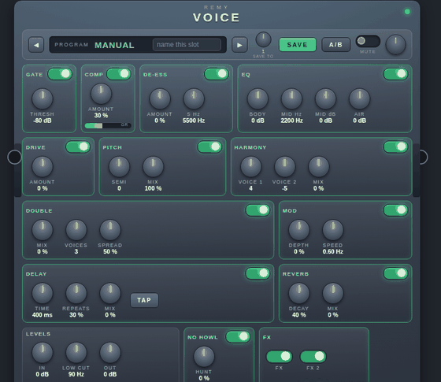

# Voice

A vocal channel strip and effects rack for the [MOD Dwarf](https://mod.audio).
Two plugins in one bundle: **Voice** (1 in, 1 out) and **Voice Stereo**
(2 in, 2 out).

## Why

A VoiceLive does two jobs at once. It follows the *pitch* of the voice to
build harmonies, and around that it runs a channel strip and an effects
rack. The pitch half is the half that fails on stage: it wants a guide
chord or a key, it smears on consonants, and it goes wrong most where the
stage is loudest.

This is the other half, on purpose. There is no pitch detection anywhere
in it — nothing to track, so nothing to mistrack. Every block works on
level and time alone, which is why none of it needs to know what note is
being sung, and why it behaves the same on a spoken word, a scream, two
people on one microphone, or a saxophone.

There is a **pitch shifter** in here, and it is not a contradiction:
shifting is not detecting. The signal is read out of a delay line at
another rate, which *is* a transposition, and nothing has to know what
note it was. Baritone, tenor, helium and an octave down all come out of
that one trick. What you give up is the thing that genuinely needs
detection: harmonies in a key, and correction. What you get back is
everything else a VoiceLive does to a voice, running on hardware you
already own, with the effects fed by a switch that lets the tails ring
out.

## The chain

```
        [on] [on]  [on]    [on]                    [on]
IN GAIN → LOW CUT → NO HOWL → GATE → COMP → DE-ESS → EQ → DRIVE → PITCH
     ┬─→ (dry) ────────────────────────────────────────────────┬─→ OUTPUT
     ├─→ [on] DOUBLE ──────────────────────────────────────────┤
     ├─→ [on] MOD ─────────────────────────────────────────────┤
     └─→ [on] DELAY ─┬────────────────────────────────────────┤
                     └─→ [on] REVERB ─────────────────────────┘
                          all four also under one master FX switch
```

**Every effect has its own switch**, made for a footswitch, and each one
sits immediately in front of the controls it switches. On top of them, the
**FX** master feeds all four effects or stops feeding them at once.

Switching off stops the *send*, never the return: the delay and the reverb
ring out instead of being chopped. That is the same idea the Fade plugin
in this repository exists for. Every switch is a 40 ms ramp, so a foot on
any of them fades rather than clicks.

## The program list

**PROGRAM** is a list, not a knob: MANUAL, then sixty-six built-in sounds,
then six USER slots of your own. Put it on an encoder and you can walk
through them from the device. The list is grouped by family — spoken
voices first, then singing, doubling and choirs, pitched voices, grilles
and loudspeakers, echoes and rooms, and last the instrument sounds — so
walking it goes somewhere rather than everywhere.

What a program takes over, and what stays yours, is a deliberate split:

| | |
|---|---|
| The program owns | low cut, gate threshold, comp, de-ess, the three tone bands, drive, double, voices, mod, delay and reverb — everything that makes up *the sound* |
| You always own | **IN GAIN** and **OUTPUT** (rig levels — a master volume that stops responding is a broken master volume), the **FX** master, **TAP**, and every effect switch |

**A program is a starting point, not a cage.** Turn any control it owns and
that one control comes back to you on the spot, while the rest of the
program stays in force. Choosing another program hands everything back to
it. The switches work the same way: selecting a program *adopts* its switch
positions — pick Ballad and the doubler, delay and reverb come in with it —
and then lets go, because a footswitch that stopped working when a program
was chosen would be worse than having no programs at all.

That is what makes the USER slots useful rather than decorative: pick
Cathedral, decide it wants less reverb and a shorter delay, turn those two,
point **USER SLOT** at slot 3 and press **SAVE**. What gets stored is what
you were hearing — the program *plus* your changes — and Cathedral itself is
untouched.

Two consequences worth knowing. A knob you have not touched under a program
reads whatever it last read in the web UI, though the device screen always
shows what is really in force — the same honest problem as the tapped tempo.
And reloading a pedalboard takes the switch positions from the saved ports,
not from the program, so a board comes back exactly as you left it.

## Controls

| Control | What it does |
|---|---|
| **PROGRAM** | The list: MANUAL, sixty-six built-in sounds grouped by family, then six USER slots of your own. MANUAL means the controls below are yours; anything else overrides them while it is selected. Address it to an encoder and walk the list from the device. |
| **SAVE** | Stores **what you are hearing** into the slot USER SLOT points at — the program you picked plus every change you made to it. |
| **USER SLOT** | Which of the six USER slots SAVE writes to. A list of its own, so a built-in sound can be changed and kept somewhere else without the original being touched. |
| **IN GAIN** | −20 to +40 dB. A dynamic microphone straight into the Dwarf usually wants +20 to +30. No preset and no program ever touches it. |
| **LOW CUT** | 0–400 Hz, 6 dB/octave. Rumble, handling noise and plosives, before they reach the gate. At 0 it is off. |
| **GATE** | Threshold, −80 to −20 dB. 6 dB of hysteresis and an 80 ms hold, so a held note does not chatter. At −80 dB it is off. |
| **COMP** | 0–100 %. One control: it lowers the threshold and raises the ratio together, from off to −40 dB at 6:1. What it gives back is what it takes off a voice at −12 dBFS, so turning it up changes the sound, not how loud you are. |
| **DE-ESS** | 0–100 %. Compresses the band above 5.5 kHz alone: an S loses its edge, the word does not go dull. |
| **BODY** | ±12 dB below ~240 Hz. |
| **PRESENCE** | ±12 dB between ~1 and 4.5 kHz. Where a voice cuts through a band. |
| **AIR** | ±12 dB above ~6 kHz. |
| **DRIVE** | 0–100 %. Soft saturation that measures itself either side of the saturator, twice a second, and corrects the difference: the colour changes, how loud you are does not — at any input level, which a fixed reference could not do. |
| **… ON** | One switch per effect — GATE, COMP, DE-ESS, DRIVE, DOUBLE, MOD, DELAY, REVERB — each sitting immediately in front of the controls it switches. Made for footswitches. DELAY and REVERB cut what goes *in*, so their tails ring out. |
| **DOUBLE** | 0–100 %. How much of the doubled voices is heard. They arrive 26 to 52 ms late, each held a constant few cents off the lead, each with its own drift, its own vibrato — which swells and relaxes on a cycle of its own — and its own throat, brighter or darker than the lead. |
| **VOICES** | 2, 3 or 4. Two is a straight double, three is thicker, four is a small choir. The level is held steady as the count changes, so this picks a texture and not a volume. In the stereo build they alternate left and right, with the odd one up the middle. |
| **SPREAD** | How far apart the voices stand: their detune, their drift and how staggered their entries are. Low is one singer twice; high is a group who have never met. |
| **NO HOWL** / **HUNT** | The anti-Larsen hunter. Sixteen filters listen for a band that rises and then just *sits* there — which is what feedback does and singing does not — and drop a narrow notch on it. At 0 it is off and costs nothing. NOTCHES says how many are in place. |
| **MOD** / **MOD SPEED** | Chorus depth and rate, 0.05–8 Hz. The two sides move a quarter cycle apart in the stereo build. |
| **DELAY** / **REPEATS** / **DELAY MIX** | 20–2000 ms, up to 95 % feedback. The repeats lose their top and their bottom each time round, so a long tail sits behind the voice. |
| **REVERB** / **REVERB MIX** | Tail length and how much is heard. At 100 % mix the tail sits at the same level as the dry voice — measured, not guessed. |
| **FX** | The master switch: on, all four effects are fed; off, their send is cut over 40 ms and the tails ring out. It sits on top of the individual switches, not instead of them. Meant for a footswitch. |
| **FX 2** | A second switch on the same state, for a second footswitch or a MIDI controller — a port can only take one addressing. Either switch moving flips the state. |
| **FX TRIGGER** | One pulse flips the same state. Meant for MIDI. |
| **TAP** | Two presses set the delay time. Meant for a footswitch. |
| **OUTPUT** | −60 to +12 dB. At −60 the plugin is silent. |

And five outputs, for the screen, the web UI and anything else that
watches: **GR** (compressor reduction in dB), **LEVEL** (peak out),
**GATE OPEN**, **FX STATE**, and **TIME** (the delay time actually in
force).

Those last two exist for the same reason Fade's STATE does: TOGGLE and
TRIGGER drive one internal state, and TAP overrides a knob, but an LV2
plugin must not write into a control *input* port. So the widget can go
stale and the output tells the truth.

## On the device screen

Address any of these to a knob or a footswitch and the plugin takes over
the readout:

| Addressed control | What the screen shows |
|---|---|
| **OUTPUT** | A level meter: peak dB, a bar, and a red LED past −1 dB, where the ceiling starts working. |
| **COMP** | `COMP GR` and how many dB it is taking off *right now*, with a bar. |
| **GATE** | `OPEN` or `SHUT`, with a bar following the gate's own fade. |
| **DELAY** | The time in force, in ms — and the label reads `TAP` instead of `DELAY` when the tap owns it, rather than showing a knob position that is no longer true. |
| **TAP** | The tempo in BPM, and the LED blinks it back at you. |
| **FX** / **FX TRIGGER** | `ON` or `OFF`, green or dark. |
| any effect switch | Its own name — `DELAY`, `REVERB`, `DOUBLE`… — with `ON` or `OFF` and the LED to match. It shows what is actually in force, which after a program change is not always what the knob says. |
| **PROGRAM** | The name of the sound in force: `MANUAL`, `BALLAD`, `CATHEDRL`… |
| **VOICES** | How many voices the doubler is running. |

## Levels

Every program lands within about a decibel of a transparent plugin, measured
on a *sung phrase* — loud lines, quiet lines, breaths between them — and the
bench fails the build if one drifts outside ±2.5 dB. That measurement is the
point: on steady noise every preset here already looked fine, because noise
gives a compressor nothing to work on. Density is loudness, and only material
with dynamics shows it.

Three rules get them there, and they apply while you turn knobs too:

- **Nothing but you writes IN GAIN.** How loud the microphone is belongs to
  the rig, not to the sound.
- **COMP gives back what it takes off a voice at −12 dBFS.** Turning it up
  compresses harder; it does not make you louder.
- **DRIVE is matched at the same level**, so it changes the colour and not
  the volume.

## Presets, and your own sounds

Sixty-six, on both variants, and they exist twice over: as entries in the
PROGRAM list, and as LV2 presets in the plugin's own preset menu. Both come
from one table in `make_ttl.py`, and the bench runs a phrase through both
routes and subtracts — picking Ballad from the menu and selecting the
program of the same name give the same samples, or the build stops.

The list is in this order, which is also the order of the families:

| | |
|---|---|
| **One voice on its own** | Speech · Podcast · Audiobook · Voice-Over · Desk Mic · Radio Announcer · Stage Dry |
| **Singing in front of a band** | Ballad · Power Ballad · Warm Crooner · Modern Pop · Pop Lead · Rock · Rock Lead · Hard Rock Shout · Country · Cut Through · Whisper |
| **Doubling yourself, and the choir** | Tight Double · Stage Double · Wide · Backing Vocals · Stacked Backing · Choir · Wide Choir · Gospel Choir · Gospel Stack · Angel Choir · Seraphim |
| **Somebody else's voice** | Baritone · Tenor · Helium · Octave · Octave Below · Fifth Below · Monster · Robot · Alien |
| **Out of a grille** | **Hygiaphone** · Telephone · Megaphone · Walkie Talkie · Radio |
| **Echoes and rooms** | Slapback · Tape Slap · Eighth Notes · Dub · Dub Echo · Ambient · Ambient Wash · Arena · Stadium · Cathedral · Church · Basilica · Shimmer |
| **An instrument instead of the microphone** | **Guitar Solo** · Lead Solo · Guitar Crunch · Guitar Clean · Clean Chime · Acoustic Piezo · Bass DI · Harmonica · Saxophone · Rotary Keys |

Two of them answer questions that were asked out loud. **Hygiaphone** is
the speaking grille at a bank counter: nothing below 320 Hz or above
6 kHz, a hard bell at 1.8 kHz, and enough drive to make it buzz.
**Guitar Solo** is an overdriven lead that does not howl — drive at 42,
the noise gate tight at −38 dB for the space between phrases, and the
anti-Larsen hunter at 70 for the part a gate can do nothing about, which
is the howl that happens *while* you are playing.

All sixty-six are measured. The bench sings a phrase through a transparent
plugin, then through each preset, and any that lands more than 2 dB above
or 2.5 dB below the plain voice fails the build — which is how *Monster*
and *Dub*, both nearly 3 dB hot, were caught and trimmed before they ever
reached a stage.

Each writes every control it does not name at its default, so loading one
lands somewhere known instead of on top of half of whatever was there
before. Neither trigger is ever written — a preset that pressed TAP would
set a tempo as it loaded — and neither is IN GAIN.

Every effect gets a usable amount even where its switch starts *off*, so the
footswitch has something to bring in rather than turning on silence.

### Your own, on the list

Six **USER** slots sit on the end of the PROGRAM list, and they are the
answer to "custom sounds without pedalboard snapshots". Two ways in:

**From nothing.** PROGRAM on MANUAL, dial the sound, point USER SLOT at a
slot, press SAVE.

**From a built-in sound.** Pick one, change what you do not like about it —
every control you touch comes back to you — point USER SLOT somewhere and
press SAVE. What is stored is what you heard, and the sound you started
from is untouched.

Selecting a slot recalls it, and it behaves like any other program: turn a
knob and that knob is yours again, so a saved sound can be edited and saved
back.

**What you should see when it works.** Press SAVE and the list jumps to the
slot you wrote — the web UI goes there on its own, and on the pedal the
screen says `SAVED 3` for a second. That feedback exists because the honest
answer to "did it save?" used to be "yes, but nothing on the screen said
so". Walk away to another sound and come back to the slot: the knobs move
to what you stored.

The slots travel with the pedalboard: the plugin implements the LV2 State
extension and writes them out with it. That is *when the pedalboard is
saved*, so a slot stored and never followed by a board save is gone at the
next reboot — the same rule as everything else on a board.

**Why the knobs used to lie.** An LV2 plugin is not allowed to write its
own control input ports, so nothing the plugin does can move a knob on your
screen: it can only change what you hear. Selecting a sound therefore
changed the sound and left every control showing the one before it, which
made the whole list — and the USER slots with it — look like it was doing
nothing. The web UI now carries the program table itself, written into
`modgui/script-voice.js` by the same `make_ttl.py` that writes the
plugin's, and moves the knobs when the program changes, wherever the change
came from: the arrows, the dial, a footswitch, or the pedal. For a USER
slot it writes back a copy it kept in the browser at SAVE time. If you save
a slot on the pedal and then open the board on a browser that has never
seen it, the *sound* is right — that copy lives in the plugin — and the
knobs will be the ones the board was saved with. The device screen never
had this problem: it always showed what was in force.

**Naming** is the one part that is split. A control port carries a number,
not text, so the plugin has no way to receive a name: the name you type in
the web UI is kept **in that browser**, while the sound itself lives in the
plugin. On the device screen a slot reads `USER 1` to `USER 6`. If you want
a sound named everywhere, add it to `PRESETS` in `make_ttl.py` and rebuild
— it becomes a program *and* an LV2 preset, with its name on the screen.

mod-ui's own **Save** on the plugin block is the other route: it writes a
plugin preset — your settings, under your name, in the same menu as the
built-in ones, not a pedalboard snapshot. Use that when you want a long
name and a long list; use the USER slots when you want it under your foot.

## The web UI



Every effect is a box with its switch in the corner, and **ON is a lit
green track with a white knob and a glow**, next to a plain grey OFF — the
first version of this plugin shipped without a custom interface at all, and
mod-ui's default one drew switch states in a violet you could not see. The
section a switch belongs to lights its border too.

The bar across the top is the program list: arrows to walk it, the name of
what is selected, a text box that names a USER slot, and SAVE. The
compressor box carries a gain-reduction meter and the levels box an output
meter, both fed by the plugin's own outputs. TAP is a button as well as a
port.

The jacks sit *outside* the panel, on a socket rail down each edge — which
is why the stylesheet must never put `overflow: hidden` on the pedal. The
first version of this interface did, and it looked immaculate right up
until somebody went to plug a cable in and found there was nowhere to plug
it: the sockets had been clipped away along with the corners. There is now
a check for exactly that, and the shipped screenshot is framed wide enough
to show them.

The interface is checked the way the rest of the plugin is:
`check_modgui.js` renders the template with mustache — the engine mod-ui
itself uses — then walks the DOM: every control port must be reachable, every
audio port must have its jack, the script must evaluate *and run*, throwing a
switch must really light its section, and the two constants the script cannot
work out for itself must match `programs.h`. `make_screenshot.js` then
photographs the result through Chromium, and refuses to write the image if
anything overflows the pedal — which is also where the screenshot in this
README comes from.

## Install

### With the web page

`install-voice.html` carries the whole bundle. Upload it to User Files and
open it from the device's own File Manager: one button, no terminal. The
page must be served *by the Dwarf* — opened from your own disk, the
browser blocks the request.

### With the terminal

Check what you downloaded before sending it:

```sh
rm -rf /tmp/voice-inst && mkdir -p /tmp/voice-inst
tar xf voice-aarch64.tar.gz -C /tmp/voice-inst
od -An -tx1 -N1 -j4 /tmp/voice-inst/voice.lv2/voice.so   # must print 02
grep -ao 'VOICE_BUILD[A-Za-z0-9_]*' /tmp/voice-inst/voice.lv2/voice.so
```

`02` is the ELF class byte: 64-bit. The Dwarf is aarch64 and refuses a
32-bit binary with `wrong ELF class: ELFCLASS32`.

```sh
cd /tmp/voice-inst
COPYFILE_DISABLE=1 tar czf - --exclude='._*' voice.lv2 \
  | ssh root@192.168.51.1 'rm -rf /root/.lv2/voice.lv2 \
      && tar xzf - -C /root/.lv2 \
      && systemctl restart mod-ui'
```

`COPYFILE_DISABLE` is not optional on macOS: the `._*` files it otherwise
adds are mistaken by lilv for bundle directories, and the plugin fails to
load. Remove the block from your pedalboard before installing and add it
back afterwards — mod-ui caches a failed load.

## Build

Needs an aarch64 cross-compiler, `rapper`, `python3`, and a native `gcc`
with the LV2 headers for the test bench:

```sh
./build.sh
```

It validates the descriptors, cross-checks them against the C source, runs
the whole test bench, compiles, packages, verifies the binary *extracted
from the archive* (64-bit, libc only, nothing newer than GLIBC 2.17), and
regenerates the installer page around the tarball it just built. Any one
of those failing stops the build before an archive exists.

The descriptors are generated:

```sh
python3 make_ttl.py     # voice.ttl, voice_stereo.ttl, presets.ttl, manifest.ttl
```

The two variants differ only in their audio ports and share all twenty-six
controls, so the list lives in one place. `check_descriptor.py` then reads
the generated files back and compares them, entry by entry, against the
table in `voice.c` — which is written by hand. A default that is right in
one and wrong in the other is invisible until a singer plugs in and the
gate is shut.

Tests on their own:

```sh
gcc -std=c99 -O1 -g -fsanitize=address,undefined -I.. -I. -o test_voice test_voice.c -lm
./test_voice
```

338 checks: the approximations against libm, every block of the chain
against what it claims to do, every switch for what it removes and for the
click it must not make, all sixty-six presets for the level they land on,
the delay against a clock at three sample rates, and a simulated HMI
screen. Without a simulated screen none of the
display code ever runs, and that is where the bugs live.

A doubler is judged by ear, though, and no test can do that:

```sh
./test_voice --demo        # writes voice-demo.wav
```

One phrase sung on "ah" - a glottal pulse train through three formants,
with vibrato, a little jitter and a breath, which is not a recording but
is close enough for the question - played dry, then through Tight Double,
Choir, Wide Choir, Angel Choir and Gospel Choir, each with its tail
ringing into the gap that follows it.

## Notes on the implementation

- **No libm.** The bundle must link against libc alone, so `log2` and
  `exp2` are degree-5 polynomials over the float's own exponent bits
  (0.0002 dB and 0.000002 dB of error, measured), the LFOs are a parabola
  with one refinement pass (0.06 %), and one-pole cutoffs come from
  `w/(1+w)` rather than a tangent. Every one of those is measured against
  the real function in the bench.
- **One allocation.** Delay lines, doubler line and reverb — 900 kB of it
  at 48 kHz in stereo — come out of a single `calloc` in `instantiate()`,
  sliced into pointers. `cleanup()` frees two things and cannot leave a
  piece behind.
- **The de-esser's band split has to be complementary.** Two high passes
  in series measured 0.2 dB of ducking on an 8 kHz tone where the
  arithmetic promised 26: the band and the signal it is subtracted from
  were out of phase. A two-pole low pass, with the band taken as
  `input − lowpass`, gives 12 dB, because there the two halves really do
  sum back to the input.
- **DRIVE is level-matched by measurement, not by formula.** Compensating
  the peak gain at one reference level - which is what this did, at
  −12 dBFS - is not enough, because saturation is compression: the peaks
  stay where they were and the average comes up. Measured on a sung
  phrase, the top of the knob was **+7.3 dB** louder, and **+11.9 dB** on
  a quiet singer, which is most of the reason a preset with any drive in
  it arrived shouting. The stage now keeps a slow average of what goes
  into the saturator and of what comes out of it, and scales the wet
  signal by the ratio - two fifths of a second, so it follows the passage
  rather than the syllable. The same measurement now reads **−0.6 to
  −2.0 dB** across a fifteen-decibel range of input level. The average is
  taken of what the saturator produces rather than of what leaves the
  stage: measure after the correction and the correction becomes its own
  input, and it flips about instead of settling.
- **The compressor is level-matched at −12 dBFS**,
  which is about where a voice sits mid-chain. It was compensated by a
  formula first, and the formula *gave* nearly 12 dB at COMP 65 — which,
  on top of a preset that also moved IN GAIN, is why the first presets
  came out shouting. What is given back is now the reduction the same
  curve applies at the reference level: measured, not derived.
- **The doubled voices are micro-shifters, not delay taps.** A delay whose
  length is wobbled by a sine has an average pitch offset of exactly zero
  and passes back through unison twice a cycle — at which moments it is a
  plain delayed copy, which is a comb filter. That is why the first version
  of this doubler sounded like an effect and not like people. Each voice now
  runs its own grain pair at a *constant* detune, seven to twenty-three
  cents at the middle of SPREAD, so it beats against the lead at a steady
  rate and never returns to unison. No two detunes are symmetric or in a
  small-integer ratio, or their beats lock into one pulsation and you hear a
  tremolo instead of a group. On top of that each voice has its own slow
  drift, its own small vibrato, its own entry time, its own window length
  and its own filtering, top and bottom — identical spectra fuse back into
  one object however far apart they are tuned.
- **And the vibrato itself breathes.** A vibrato of fixed depth is the one
  thing no singer does, and it is what made four copies read as four
  oscillators rather than as four people. Each voice's depth now rides a
  very slow sine of its own — twelve to thirty-three seconds a cycle — so
  it swells to its full width and relaxes back to a little over half of it.
  The bench measures it the only way it can be measured: it sings a steady
  note for three whole swell cycles, reads the vibrato sidebands 4.7 Hz
  either side of the first voice's carrier in three-second windows, and
  sorts them into the ones near a peak and the ones near a trough. The peak
  group comes out 1.9 times louder. If it ever comes out flat, the depth
  has stopped moving.
- **The old doubler ran two, three or four taps**, at 21, 29, 38 and 46 ms,
  drifting a few cents each on LFOs at 0.13, 0.19, 0.27 and 0.09 Hz — rates that share no
  common period, so they never line up into one wobble. Decorrelated copies
  add in power, so the level is divided by the root of the count — written
  out as a table, since there is no square root in this binary — and
  changing VOICES changes the texture without changing the volume. They are
  filtered a shade darker than the lead: three bright copies sound like a
  phaser, three darker ones sound like people. At full mix the copies sit
  about 2.5 dB under the lead, which the bench measures by running the
  same noise through the plugin twice and subtracting.
- **A program and its preset are one table.** `make_ttl.py` writes both
  `presets.ttl`, which sets ports, and `programs.h`, which the plugin reads
  directly; `check_descriptor.py` compares the two files entry by entry and
  the bench compares the *audio* they produce, sample for sample. That test
  found a real bug on its first run: `activate()` worked out which program
  was in force halfway down, after the smoothed values had already been
  initialised from the knobs.
- **The pitch shifter has no detector in it.** Two read pointers walk a
  delay line half a window apart at the rate the shift asks for, each
  crossfaded with a raised cosine that reaches zero exactly where that
  pointer wraps, so the join is never heard. Formants move with the note,
  which is why down sounds like a bigger singer and up sounds like helium
  rather than like a harmony. Measured: a 220 Hz tone comes out at 440,
  330, 165 or 110 Hz with forty decibels between the new note and the old,
  and the level holds to a tenth of a decibel. At 0 semitones the block
  steps aside rather than sitting there combing the signal with two static
  taps.
- **The USER slots go out through LV2 State as plain floats**, not as the
  struct they live in: a struct has padding, and padding is not something
  to write into somebody's saved session. A state of the wrong size is
  refused rather than believed, and a slot that was never filled stays
  empty rather than coming back full of zeros.
- **The anti-Larsen hunter tells a howl from a note by three tests, and the
  third one is the one that matters.** Sixteen band-pass filters listen to
  the mono sum *after* the notches, so a notch that is working makes its own
  band go quiet and the hunter learns it can eventually let go. A band has
  to be **loud** (dominating the broadband peak, which a chord or a strum
  never does), **steady** (within a couple of decibels of its own 700 ms
  average, which a plucked or bowed note never is)... and **harmonic-free**.
  That last one is the answer to the hard question. A held, vibrato-ed sung
  note passes the first two tests easily: vibrato moves the *pitch*, and
  inside a third of an octave the *level* does not move at all. But a note
  has an octave, and a room mode ringing on its own does not — so if the
  band three up (an octave and a bit) has anything in it, the band is
  vetoed. The bench holds it to that: a howling room is silenced, a sung
  note with harmonics and vibrato collects no notches at all. The price is
  written down honestly — a genuinely pure sustained tone with no harmonics,
  a whistle or a sine pad, looks exactly like feedback and will be notched.
- **Where the howl actually is** comes from fitting a parabola through the
  three neighbouring band levels in the log domain, which places it inside a
  third-octave band to a few percent and buys a notch narrow enough not to
  be heard. Measured, not assumed: at a Q past about five the notch starts
  missing and the howl simply walks to the next peak of the room, costing a
  second notch.
- **Every switch is a 40 ms ramp**, never a branch. The bench throws all
  eight while a note is playing and fails if the biggest sample-to-sample
  step during the throw is more than half again the biggest step while
  nothing is moving.
- **Gate, compressor and de-esser share one detector across both
  channels.** Independent detectors pull the stereo image sideways every
  time one side is louder, which on a voice is every sibilant. The bench
  checks the two channels are bit-identical through the whole strip.
- **DRIVE at zero is exactly unity.** The saturated signal is blended in,
  not switched in: a stage bypassed by a branch steps the level of a loud
  passage by nearly 2 dB the moment the control leaves zero.
- **There is an output ceiling**, transparent below 0.85 and asymptotic at
  1.0. Four wet effects and a drive stage can sum past full scale, and the
  converter should not be the thing that finds out.
- **Denormals are flushed** in every feedback path. They cost tens of
  cycles each on this CPU and are inaudible by definition.
- **Screen writes are capped at 25 passes per second**, with a full cache
  flush once a second so the display survives the firmware's repaints.
- The delay time *glides* to a new value rather than jumping, so turning
  the knob bends the pitch of what is in the line, like tape. A tap is
  resolved to one audio block — under 3 ms, finer than a foot.
- Cost: about 1.5 % of one core of an x86-64 build machine for the stereo
  variant with every effect on. Not measured on the device.

## What it does not do

- No pitch *detection*, and therefore no harmony in a key and no
  correction. That is the point, not an omission. Pitch *shifting* by a
  fixed interval needs no detection and is in here.
- No MIDI input: every switch, the two lists and the tap take a control
  port each, which
  is what the Dwarf addresses to a footswitch or to a MIDI CC.
- LOW CUT and the three tone bands have no switch of their own. They have
  neutral positions — 0 Hz and 0 dB — and a switch that only duplicates a
  knob position is a control that can disagree with itself.
- The name of a USER slot lives in the browser that typed it, because a
  control port carries a number and not a string. The sound travels; the
  name does not follow it to another machine.
- The tone controls are three broad parallel bands, not a surgical EQ, and
  the reverb is a Freeverb — a good room, not a convolution.

## Licence

ISC, same as the rest of the repository. See [../LICENSE](../LICENSE).
